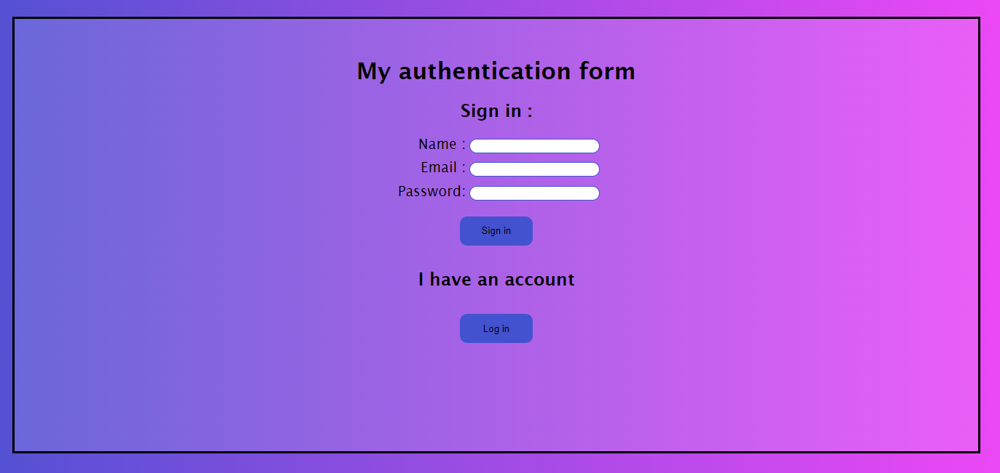
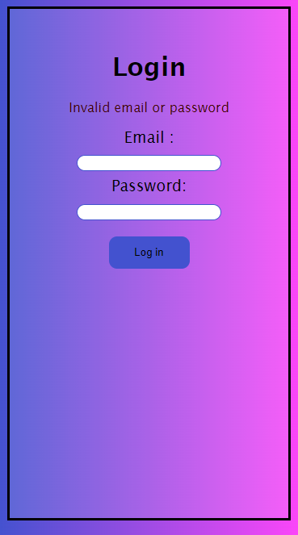

# My authentication form

Sign in, log in and log out using PHP sessions.

## Screenshots

### Sign in page (Desktop)



## Log in page (Mobile)



### Home page (Mobile)


## Run the project

### Create a database : 

```sql
CREATE DATABASE IF NOT EXISTS `authentication` DEFAULT CHARACTER SET utf8mb4 COLLATE utf8mb4_0900_ai_ci;
USE `authentication`;

DROP TABLE IF EXISTS `user`;
CREATE TABLE IF NOT EXISTS `user` (
  `id` int NOT NULL AUTO_INCREMENT,
  `name` varchar(255) COLLATE utf8mb4_general_ci NOT NULL,
  `email` varchar(255) COLLATE utf8mb4_general_ci NOT NULL,
  `password` varchar(255) COLLATE utf8mb4_general_ci NOT NULL,
  PRIMARY KEY (`id`)
) ENGINE=InnoDB AUTO_INCREMENT=4 DEFAULT CHARSET=utf8mb4 COLLATE=utf8mb4_general_ci;
```

### Create a `config.php` file : 

```php
<?php
define('DB_HOST', 'your_host');
define('DB_NAME', 'your_dbname');
define('DB_USER', 'your_username');
define('DB_PASS', 'your_password');
```


